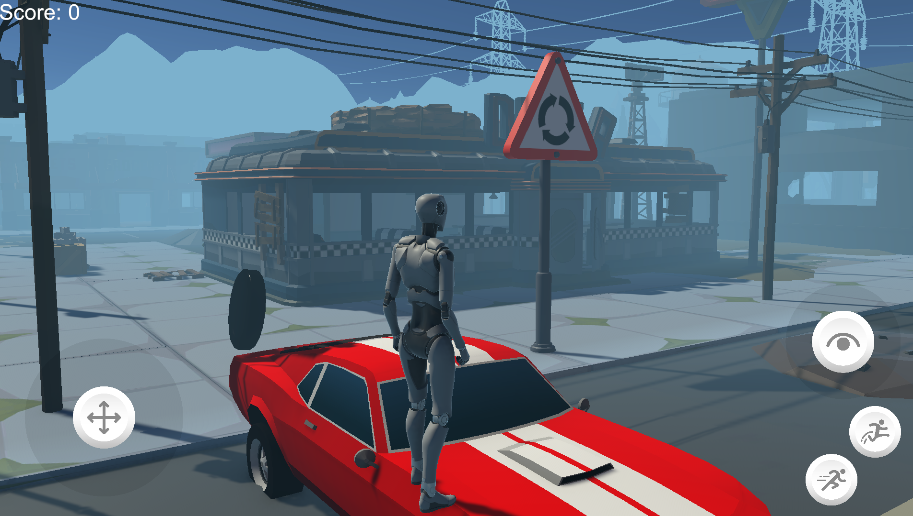
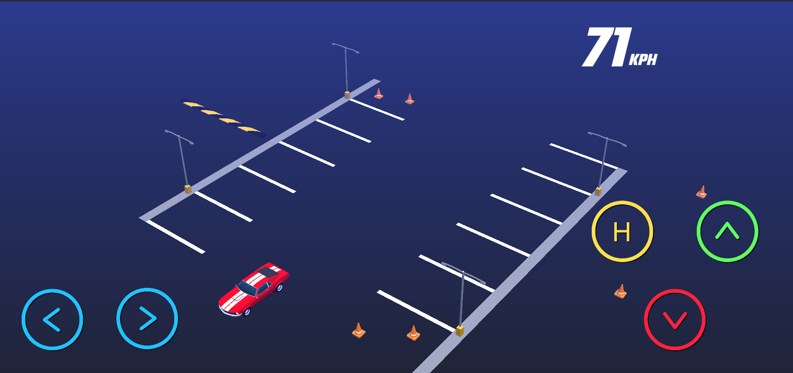
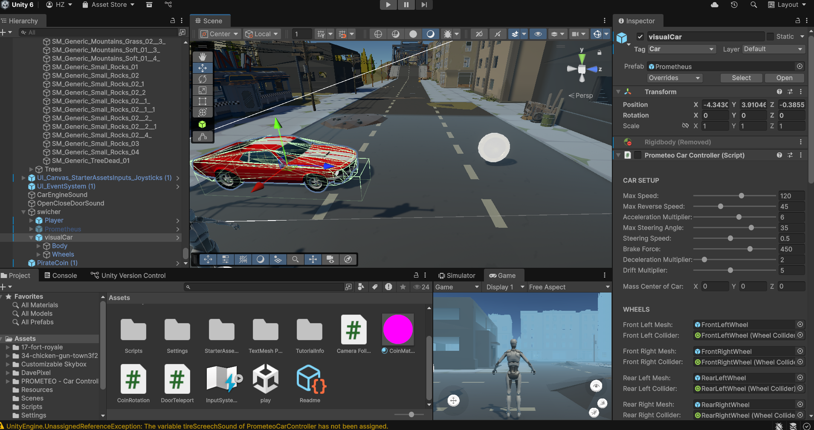
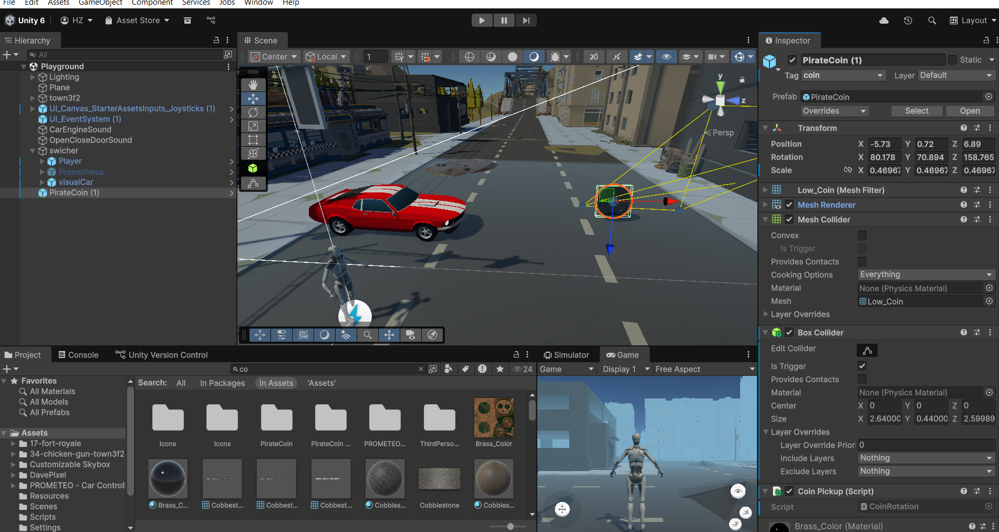
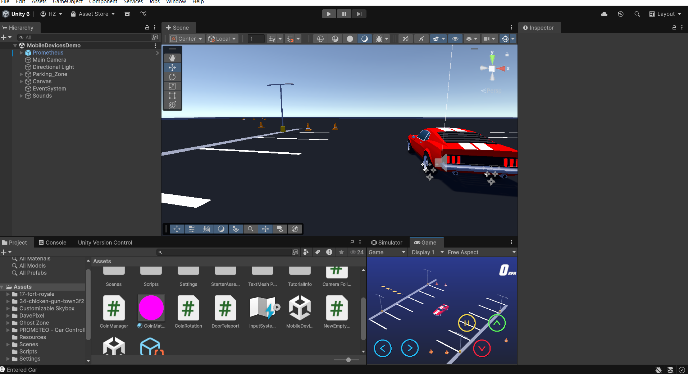

# Project Title

This project is about [project description].

## Table of Contents
- [Installation](#installation)
- [Usage](#usage)
- [Images](#images)

## Installation

1. Install the necessary dependencies.
2. Clone the project:
   ```bash
   git clone <repo-url>
   ```
3. Open and run the project.

## Usage

Information on how to use the project.

## Images

Below are the images related to the project:









